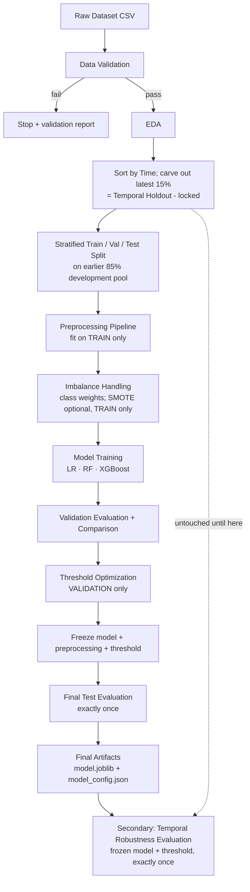
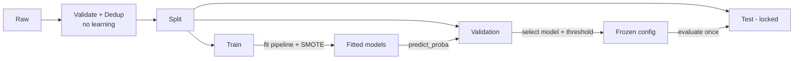
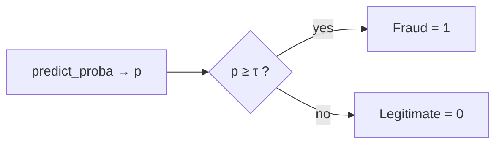
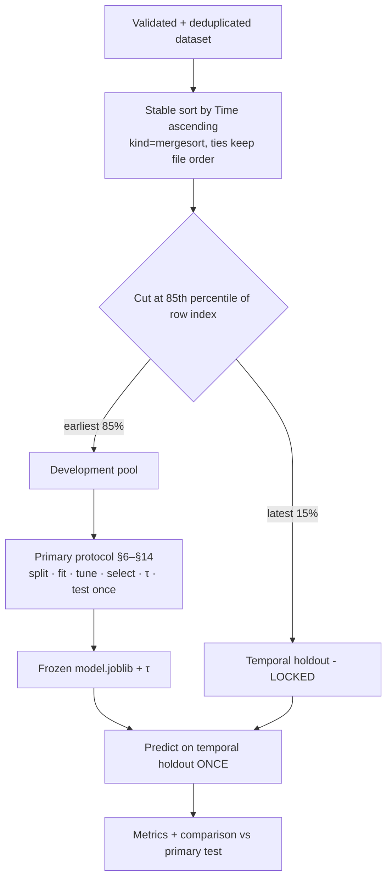

# Credit Card Fraud Detection — Data & ML Design

| Field | Value |
|---|---|
| Document ID | DOC-02 |
| Status | Baseline v1.1 (Source of Truth) — adds §21 Temporal Robustness Analysis |
| Implements | `docs/01_Project_Requirements_and_Scope.md` (DOC-01) |
| Tags | **[REQ]** requirement · **[DEC]** confirmed decision · **[ASM]** assumption · **[REC]** recommendation · **[EMP]** requires empirical validation |

---

## 1. ML Architecture Overview



| Stage | Purpose | Output |
|---|---|---|
| Data Validation | Guarantee schema, target, and quality before anything else | `reports/validation_report.json` |
| EDA | Understand imbalance, `Amount`/`Time`, class separation; justify decisions | `reports/eda/` (few figures + summary) |
| Temporal carve-out | Reserve chronologically latest transactions for secondary evaluation | `data/processed/temporal_holdout.csv` |
| Split | Leakage-safe partition of the development pool preserving class ratio | `data/processed/{train,val,test}.csv` |
| Preprocessing | Deterministic transformations inside a sklearn Pipeline | Part of pipeline object |
| Imbalance Handling | Make the learner sensitive to the minority class | Pipeline/model params |
| Training | Fit each candidate on train | Candidate pipelines |
| Validation Evaluation | Compare candidates with imbalance-aware metrics | `reports/model_comparison.csv` |
| Threshold Optimization | Choose operating point on validation probabilities | `reports/threshold_analysis.csv` + plot |
| Final Test Evaluation | Unbiased estimate of the frozen configuration | `reports/test_metrics.json` |
| Artifacts | Inference-ready bundle | `models/model.joblib`, `models/model_config.json` |
| Temporal Robustness (secondary) | Check frozen model on later transactions; compare with primary test | `reports/temporal/` (§21) |

## 2. Dataset Specification

**Documented facts (public dataset description — verify on load):** European cardholder transactions over two days (September 2013); 284,807 transactions with 492 frauds (≈0.172%); `V1`–`V28` are principal components from a PCA transformation of confidential features; `Time` is seconds elapsed since the first transaction in the dataset; `Amount` is the transaction amount; `Class` is the label.

| Column | Type (expected) | Role | Notes |
|---|---|---|---|
| `Time` | float | **Ordering key only (not a feature)** | Relative seconds, not a clock time or date **[ASM]**; used solely to order data for §21 |
| `V1`–`V28` | float | Features | Anonymized; **no semantic meaning shall be assumed** |
| `Amount` | float | Feature | Right-skewed, non-negative **[ASM]** |
| `Class` | int | Target | 0 = legitimate, 1 = fraud |

Considerations:
- **Anonymized features** cannot be engineered from domain knowledge; they are already roughly centered (PCA outputs), so heavy transformation is unnecessary.
- **Amount** is not PCA-transformed and has a different scale; needs scaling for LR.
- **Time** spans ~2 days; it is a relative counter. It is used **only** to establish chronological order for the temporal holdout and is **excluded from model features** (rationale in §21.2). No hour-of-day derivation is performed.
- **Imbalance** is extreme; all metrics and splits must account for it.

**To verify against the actual CSV [ASM]:** column set and order, dtypes, row count, fraud count, presence of duplicates, value ranges of `Time`/`Amount`. If the schema differs, the implementation adapts the column lists in config while preserving this design (§19).

## 3. Data Validation

All checks run in `validate_data()` and write a JSON report.

| Check | Rule | On failure |
|---|---|---|
| File existence | Path in config exists and is readable | **Hard fail** |
| Schema / required columns | `Time`, `V1`–`V28`, `Amount`, `Class` present | **Hard fail** |
| Unexpected columns | Any extra column | **Warn**; drop from features (not used) and report |
| Data types | All features numeric; target integer-castable | **Hard fail** |
| Missing values | Count per column | **Hard fail** if in `Class`; features: warn + handled by imputer (§7) |
| Infinite values | ±inf in any feature | **Hard fail** (indicates corrupt data) |
| Duplicate rows | Exact duplicates across all columns | **Warn**; apply duplicate policy below |
| Target values | `Class` ⊆ {0,1} and both present | **Hard fail** |
| Class distribution | Counts + fraud % | Report; **warn** if fraud % outside expected order of magnitude |
| Suspicious values | `Amount < 0`; `Time < 0`; extreme outliers (report only) | Negative → **hard fail**; outliers → report, **do not remove** |

**Duplicate policy [DEC]:** drop exact duplicate rows **before splitting**, keeping the first occurrence, and log the count removed per class. Rationale: duplicates straddling train/test inflate test scores (leakage). Deduplication does not learn from data, so doing it pre-split is leakage-safe.

**Outlier policy [DEC]:** outliers are **not removed** — in fraud detection, extreme values may be the signal. Robust scaling (§7) handles them.

## 4. Exploratory Data Analysis

EDA is run on the **full deduplicated dataset for descriptive purposes only**; no parameter learned in EDA feeds the model. Each item is tied to a decision.

| # | Analysis | Artifact | Decision it informs |
|---|---|---|---|
| 1 | Shape, dtypes, head | Summary table | Schema confirmation |
| 2 | Missing + duplicate counts | Table | Validation / dedup policy |
| 3 | Class counts + fraud % | Bar chart (log y-axis) | Imbalance strategy, metric choice |
| 4 | Descriptive statistics | Table | Scaling needs |
| 5 | `Amount` distribution, overall and by class | Histogram (log x) + boxplot by class | Robust scaling / log transform decision |
| 6 | `Time` distribution by class; fraud rate over time | Density plot by class | Characterizes chronology and the prevalence the temporal holdout will have (descriptive only; not a feature decision) |
| 7 | Class-wise mean differences of `V1`–`V28` | Ranked bar chart | Sanity check of signal; supports feature importance interpretation |
| 8 | KDE of top ~6 most separating V-features by class | Small multiples grid | Evidence of nonlinearity (supports tree models) |
| 9 | Correlation with `Class` | Bar chart | Signal ranking |
| 10 | Feature–feature correlation | Heatmap | Confirms low collinearity among PCA components |

**Limit: ≤ 8 figures.** EDA findings are summarized in `reports/eda/eda_summary.md`.

## 5. Data Leakage Prevention (Mandatory)

| Rule | Why |
|---|---|
| Split **before** any fitted operation (scaling, imputation, SMOTE, feature selection) | Fitting on all data lets validation/test statistics influence training |
| Scalers/imputers fitted **only on train** (enforced by Pipeline) | Test must simulate unseen data; val/test are only `transform`ed |
| SMOTE **only on train**, **never** on val/test | Synthetic points in evaluation sets fabricate an artificial class ratio and inflate metrics |
| SMOTE applied **inside** CV folds (imblearn Pipeline) if CV is used | Otherwise synthetic neighbors leak across folds |
| Threshold chosen on **validation** only | Choosing on test turns test into a training signal |
| Model selection on **validation** only | Same reason |
| Test evaluated **exactly once**, after freezing | Repeated test peeking produces optimistic, non-generalizable estimates |
| Temporal holdout carved out **before** the primary split and never fitted, tuned, or selected on | It must represent genuinely unseen later transactions; any use would contaminate the robustness estimate |

**Leakage-safe workflow [DEC]:**



## 6. Train / Validation / Test Strategy

**[DEC]** Before this split, the chronologically latest 15% of deduplicated rows are removed as the temporal holdout (§21). The remaining earlier 85% forms the **development pool**. The primary split below is applied to the development pool only.

**[DEC]** Stratified random split of the development pool on `Class`, **70 / 15 / 15**, seed `42`.

Implementation: two-step `train_test_split` — first 70% train vs 30% temp (stratified), then temp split 50/50 into validation and test (stratified).

| Split | Share | Used for | Never used for |
|---|---|---|---|
| Train | 70% | Fitting preprocessing, resampling, models, CV tuning | Final reporting |
| Validation | 15% | Model comparison, threshold selection | Fitting anything |
| Test | 15% | One final primary evaluation of frozen config | Any decision |
| Temporal holdout (outside pool) | latest 15% of all rows | One secondary robustness evaluation (§21) | Any fitting, tuning, selection, threshold, or retraining |

Justification: with ~0.17% fraud, 15% of the development pool yields roughly 60 fraud cases per holdout set **[ASM, verify]** — small but workable; stratification guarantees fraud presence in each split. A random (not time-based) split remains the primary protocol because it gives well-balanced, stratified sets for model and threshold selection; temporal generalization is assessed separately by the secondary experiment (§21).

Hyperparameter tuning uses **stratified 3-fold CV on train only** (§10) so the validation set remains a clean comparison set.

## 7. Preprocessing Strategy

Implemented as a sklearn `ColumnTransformer` inside a `Pipeline` (imblearn `Pipeline` when SMOTE is enabled).

| Feature group | Transform | Rationale |
|---|---|---|
| `V1`–`V28` | `SimpleImputer(median)` → `StandardScaler` | Already PCA-like; scaling harmless for trees, useful for LR |
| `Amount` | `SimpleImputer(median)` → `RobustScaler` | Skewed with outliers; robust to extremes |
| Missing values | Median imputer present defensively | Expected zero missing values **[ASM]**; imputer keeps inference robust |

Optional transform: `log1p(Amount)` only if EDA shows it materially helps LR on validation **[EMP]**; default is off.

**Scaling need per model:**

| Model | Requires scaling? |
|---|---|
| Logistic Regression | **Yes** — regularization and convergence depend on scale |
| Random Forest | No (scale-invariant) — harmless |
| XGBoost | No (scale-invariant) — harmless |

**[DEC]** One shared preprocessing definition is used for all models for simplicity and train/serve consistency. Feature order is fixed by config: `["V1", …, "V28", "Amount"]` (29 features). `Time` is dropped before the pipeline and never enters `ColumnTransformer`.

## 8. Class Imbalance Strategy

**Why accuracy misleads:** with ~0.17% fraud, a constant "legitimate" predictor reaches ≈99.8% accuracy while detecting zero fraud.

| Approach | Mechanism | Pros | Cons |
|---|---|---|---|
| **Cost-sensitive learning** | Upweight minority class in the loss | No synthetic data; simple; fast; no leakage risk from resampling | Weights may need tuning |
| SMOTE | Synthesize minority samples by interpolation on train | Can help linear models | Adds dependency (`imbalanced-learn`), slower, can create noisy samples, easy to misuse |
| Random undersampling | Discard majority samples | Fast | Throws away data |

**Cost-sensitive settings:**

| Model | Setting |
|---|---|
| Logistic Regression | `class_weight="balanced"` |
| Random Forest | `class_weight="balanced_subsample"` |
| XGBoost | `scale_pos_weight = n_negative_train / n_positive_train` (computed from **train** only) |

**[DEC] Primary strategy: cost-sensitive learning** for all three models — lowest complexity, no leakage surface, well-suited to a 2-day window.

**[REC] Optional experiment:** SMOTE + Logistic Regression (no class weight) as one extra run, only if time remains after the core comparison. If run, SMOTE sits inside an imblearn Pipeline so it is applied to train folds only; val/test distributions are never altered. Not applied to tree models (limited expected benefit, doubles runtime).

Threshold optimization (§13) is itself a major imbalance lever and is applied to every model.

## 9. Candidate Models

### Logistic Regression
| Aspect | Detail |
|---|---|
| Purpose | Baseline and interpretable reference |
| Strengths | Fast, stable, coefficients are interpretable, probabilities reasonably calibrated |
| Weaknesses | Linear decision boundary; may underfit nonlinear fraud patterns |
| Preprocessing | Scaling required |
| Imbalance | `class_weight="balanced"` |
| Fixed params | `solver="lbfgs"`, `max_iter=1000`, `random_state=seed` |

### Random Forest
| Aspect | Detail |
|---|---|
| Purpose | Nonlinear bagging benchmark |
| Strengths | Captures interactions, robust to outliers, low tuning burden, feature importances |
| Weaknesses | Larger artifact, slower inference, probabilities less calibrated |
| Preprocessing | None required (shared pipeline is harmless) |
| Imbalance | `class_weight="balanced_subsample"` |
| Fixed params | `n_jobs=-1`, `random_state=seed` |

### XGBoost
| Aspect | Detail |
|---|---|
| Purpose | Gradient-boosted high-performance candidate |
| Strengths | Strong on tabular data, handles imbalance via `scale_pos_weight`, regularized |
| Weaknesses | More hyperparameters; overfitting risk on few positives |
| Imbalance | `scale_pos_weight` from train class counts |
| Relevant params | `n_estimators`, `max_depth`, `learning_rate`, `subsample`, `colsample_bytree`, `min_child_weight` |
| Fixed params | `objective="binary:logistic"`, `eval_metric="aucpr"`, `tree_method="hist"`, `n_jobs=-1`, `random_state=seed` |

No winner is declared; selection is empirical (§12).

## 10. Hyperparameter Strategy

**[DEC]** `RandomizedSearchCV` on **train only**, `StratifiedKFold(n_splits=3, shuffle=True, random_state=seed)`, `scoring="average_precision"`, `n_iter` ≤ 10 per model (LR uses a small grid). All spaces live in `config/config.yaml`.

| Model | Search space (initial) |
|---|---|
| LR | `C ∈ {0.01, 0.1, 1, 10}` |
| RF | `n_estimators ∈ {200, 400}`, `max_depth ∈ {None, 10, 20}`, `min_samples_leaf ∈ {1, 3, 5}` |
| XGBoost | `n_estimators ∈ {200, 400, 600}`, `max_depth ∈ {3, 4, 6}`, `learning_rate ∈ {0.03, 0.1}`, `subsample ∈ {0.8, 1.0}`, `colsample_bytree ∈ {0.8, 1.0}`, `min_child_weight ∈ {1, 5}` |

Budget guard **[REC]**: if RF search exceeds the time budget, reduce to `n_iter=5` and record the change. Best params per model are logged and used to refit on the full train set.

## 11. Model Evaluation

| Metric | Definition | Interpretation in this project |
|---|---|---|
| Precision | TP / (TP + FP) | Of flagged transactions, share truly fraud — review/customer friction cost |
| Recall | TP / (TP + FN) | Share of fraud caught — protection level |
| F1 | Harmonic mean of P, R | Balanced single-number summary at a threshold |
| F2 | F-beta, β=2 | Recall-weighted summary; used for threshold objective fallback |
| PR-AUC (Average Precision) | Area under precision–recall curve | **Primary threshold-independent metric**; baseline equals fraud prevalence |
| ROC-AUC | Area under ROC | Ranking quality; secondary — can look excellent under extreme imbalance because TN count is huge |
| Confusion Matrix | TP/FP/TN/FN counts | Concrete operational view at the chosen threshold |

**Why PR-AUC:** ROC's false-positive rate divides by the (enormous) negative count, so many FPs barely move it. PR-AUC focuses on the positive class and exposes the precision cost directly.

**Business meaning:**
- **FP** — legitimate transaction flagged: customer friction, manual review load.
- **FN** — fraud missed: direct loss and trust damage.
No monetary costs are assumed; relative preference for recall is encoded via R_min/F2.

Threshold-independent metrics (PR-AUC, ROC-AUC) are computed on probabilities; threshold-dependent metrics are reported at both 0.50 (reference only) and the tuned threshold.

## 12. Model Selection Strategy

**[DEC]** Selection is made on **validation** results using this ordered framework:

1. **Eligibility:** model must reach Recall ≥ R_min at some threshold on validation (if the primary threshold objective is used).
2. **Primary ranking:** validation **PR-AUC**.
3. **Operating-point check:** at each model's own tuned threshold, compare Precision (at the required recall) or F2, and FP count.
4. **Tie-break** (PR-AUC within ~0.01 **[provisional]**): prefer the model with fewer FPs at the operating point; then the simpler/faster model (LR < RF ≈ XGB in complexity; smaller artifact).
5. **Sanity:** selected model PR-AUC must exceed the LR baseline or LR is selected.

The rationale and all candidate numbers are recorded in `reports/model_selection.md`. No expected winner is stated.

## 13. Threshold Optimization



**Procedure [DEC]:**
1. Obtain validation probabilities from each fitted candidate.
2. Evaluate thresholds τ ∈ [0.01, 0.99] step 0.01, plus unique points from `precision_recall_curve`.
3. For each τ compute Precision, Recall, F1, F2, FP, FN; save to `reports/threshold_analysis_<model>.csv` and plot P/R vs τ.
4. Apply the objective:
   - **Primary [REC]:** among τ with Recall ≥ R_min, choose max Precision (tie → higher τ).
   - **Fallback:** if no τ satisfies R_min, or R_min is not justified, choose τ maximizing F2.
5. Record τ, objective used, and val metrics at τ in `model_config.json`.

**R_min:** configuration value, **provisional default 0.80 [EMP]** — a placeholder to be confirmed after inspecting validation PR curves; it is a policy target, not a predicted result. The default 0.50 is reported for reference only.

**Stability note:** with ~60 validation frauds, one fraud ≈ 1.4 pp recall. Prefer a τ in a flat region of the curve; optionally check robustness with 3-fold out-of-fold train probabilities **[REC, if time permits]**. **Never** tune τ on test.

## 14. Final Evaluation Protocol

1. Freeze preprocessing + model (refit on train only; val is **not** merged — keeps τ consistent with the model it was tuned for).
2. Freeze threshold τ and write `models/model_config.json`.
3. Load artifacts from disk (proves round-trip) and predict on test **once**.
4. Report Precision, Recall, F1, F2, PR-AUC, ROC-AUC, confusion matrix (at τ; 0.50 for reference).
5. Save `reports/test_metrics.json` and `reports/figures/test_confusion_matrix.png`.
6. Document final configuration in `reports/model_selection.md`. If test results disappoint, they are reported as-is; no retuning on test.
7. Only after steps 1–6, run the secondary temporal evaluation (§21) with the same frozen artifacts. Its results never trigger retuning or reselection.

## 15. Model Artifact Design

| File | Contents | Format |
|---|---|---|
| `models/model.joblib` | Full fitted sklearn Pipeline: ColumnTransformer + classifier (SMOTE step excluded/inactive at inference — imblearn samplers only act during `fit`) | joblib |
| `models/model_config.json` | See below | JSON |

`model_config.json` fields:
```json
{
  "model_name": "<selected>",
  "model_version": "<semver or timestamp>",
  "threshold": "<float, from validation>",
  "threshold_objective": "recall>=R_min, max precision | max F2",
  "feature_order": ["V1", "...", "V28", "Amount"],
  "ordering_column": "Time",
  "temporal_holdout_fraction": 0.15,
  "target": "Class",
  "positive_label": 1,
  "trained_at": "<ISO-8601>",
  "random_seed": 42,
  "data_hash": "<sha256 of raw CSV>",
  "library_versions": {"scikit-learn": "", "xgboost": "", "imbalanced-learn": ""},
  "validation_metrics": {},
  "test_metrics": {},
  "temporal_holdout_metrics": {}
}
```

**Why:** preprocessing and model travel together, so the serving layer calls `pipeline.predict_proba(df[feature_order])` and cannot apply a different transformation; the threshold is kept separate so it can be inspected or changed without retraining.

## 16. Reproducibility Requirements

| Item | Requirement |
|---|---|
| Seeds | Single `random_seed` in config → split, CV, models, SMOTE, numpy |
| Configuration | `config/config.yaml`: paths, feature lists, ordering column (`Time`), temporal holdout fraction, split ratios, search spaces, R_min, threshold grid |
| Dependencies | Pinned `requirements.txt`; Python version recorded |
| Determinism | `n_jobs` may vary thread scheduling; RF/XGB with fixed seed are deterministic on CPU in practice; minor float differences tolerated |
| Data version | SHA-256 of raw CSV recorded in metadata (DVC hash later) |
| Experiment metadata | Every run emits params, metrics, artifact paths as a dict/JSON structure directly loggable to MLflow |

Agreed dependencies: `pandas`, `numpy`, `scikit-learn`, `xgboost`, `imbalanced-learn` (only if SMOTE experiment runs), `matplotlib`, `seaborn`, `pyyaml`, `joblib`. Later phases add `dvc`, `mlflow`, `fastapi`, `uvicorn`, `pydantic`, `pytest`.

## 17. Expected Outputs

| Output | Location |
|---|---|
| Validation report | `reports/validation_report.json` |
| EDA figures + summary | `reports/eda/` |
| Split datasets | `data/processed/{train,val,test}.csv` |
| Temporal holdout | `data/processed/temporal_holdout.csv` |
| Reproducible preprocessing | Inside pipeline in `models/model.joblib` |
| Candidate models | `models/candidates/{lr,rf,xgb}.joblib` |
| Validation comparison | `reports/model_comparison.csv` |
| Threshold analysis | `reports/threshold_analysis_<model>.csv`, plots |
| Final model | `models/model.joblib` |
| Threshold + metadata | `models/model_config.json` |
| Test metrics | `reports/test_metrics.json` |
| Temporal robustness outputs | `reports/temporal/` (see §21.7) |
| Training config | `config/config.yaml` |

## 18. Future MLOps Integration Points

| Tool | Boundary |
|---|---|
| **DVC** | Track `data/raw/creditcard.csv`; stages `validate → split (incl. temporal carve-out) → train → evaluate → evaluate_temporal` with the file outputs in §17 as stage deps/outs; `config.yaml` as params |
| **MLflow** | One run per candidate: params (model, hyperparams, imbalance strategy, seed), metrics (val P/R/F1/F2/PR-AUC/ROC-AUC), artifacts (threshold CSV, plots, candidate model); final run: selected model, τ, test metrics, temporal-holdout metrics (prefixed `temporal_`) and comparison table, `model.joblib`, `model_config.json` |
| **Git** | Source code, `config/`, `docs/`, `dvc.yaml`, `requirements.txt`; **not** raw data or model binaries |
| **FastAPI** | Loads `model.joblib` + `model_config.json`; enforces `feature_order` |
| **Docker / Pytest** | Consume pinned requirements; tests target validation, split ratios, leakage rules, threshold selection, inference round-trip |

## 19. Risks and Mitigations

| Risk | Impact | Mitigation |
|---|---|---|
| Severe class imbalance | Models ignore fraud | Class weighting, PR-AUC focus, threshold tuning |
| Data leakage | Inflated metrics | Split first, Pipeline fitting, SMOTE train-only, dedup pre-split, test-once rule, leakage unit tests |
| Overfitting | Poor generalization | CV on train, small search space, regularized XGB, val-based selection |
| Misleading accuracy | Wrong model chosen | Accuracy excluded from selection |
| Threshold instability (few val positives) | Test recall differs from val | Choose τ in a flat region; report 0.50 reference; optional OOF check |
| Train/serve mismatch | Wrong predictions in production | Single pipeline artifact + stored `feature_order` |
| Seed variability | Non-reproducible results | Global seed, config-driven runs |
| Dataset/schema change | Pipeline breaks silently | Hard-fail validation; feature lists in config; data hash in metadata |
| Random (non-temporal) split | Optimistic vs. real deployment | Secondary temporal robustness experiment (§21) quantifies change on later transactions |
| Temporal holdout leakage | Robustness result invalid | Carve-out before primary split; isolation unit test (no row IDs shared; no fit calls on holdout) |
| Few frauds in temporal holdout | Noisy temporal metrics | Report fraud count and prevalence; interpret small changes cautiously (§21.6) |
| Over-interpreting degradation | False drift claims | Interpretation rule: evidence of possible shift, not proof of production drift |

## 20. Technical Decision Log

| ID | Decision | Status |
|---|---|---|
| TD-01 | Exact-duplicate removal before split | Confirmed |
| TD-02 | Outliers retained | Confirmed |
| TD-03 | Stratified 70/15/15, seed 42, random split | Confirmed |
| TD-04 | Shared ColumnTransformer; RobustScaler for `Amount`, StandardScaler others, median imputer | Confirmed |
| TD-05 | `log1p(Amount)` | Requires empirical validation |
| TD-06 | Cost-sensitive learning as primary imbalance strategy | Confirmed |
| TD-07 | SMOTE + LR as optional single experiment | Provisional (time-dependent) |
| TD-08 | Candidates: LR, RF, XGBoost | Confirmed |
| TD-09 | RandomizedSearchCV, 3-fold stratified, AP scoring, ≤10 iters | Confirmed |
| TD-10 | Model selection by val PR-AUC + operating-point check | Confirmed framework; winner requires empirical validation |
| TD-11 | Threshold objective Recall ≥ R_min → max Precision; F2 fallback | Confirmed method |
| TD-12 | R_min = 0.80 | Provisional; requires empirical validation |
| TD-13 | Threshold value τ | Requires empirical validation |
| TD-14 | No refit on train+val after selection | Confirmed |
| TD-15 | Artifact = `model.joblib` + `model_config.json` | Confirmed |
| TD-16 | Dataset facts (rows, fraud %, columns) | Requires verification on CSV |
| TD-04a | `Time` removed from features; ordering key only (amends TD-04) | Confirmed |
| TD-17 | Temporal holdout = chronologically latest 15% of deduplicated rows, carved out before the primary split | Confirmed method; fraud count requires verification |
| TD-18 | Primary 70/15/15 split applied to the earlier 85% development pool | Confirmed |
| TD-19 | Temporal holdout is evaluation-only; evaluated once with frozen model + τ after primary test evaluation | Confirmed |
| TD-20 | Temporal results compared to primary test via absolute and relative deltas plus prevalence-adjusted PR-AUC | Confirmed method; values require empirical validation |
| TD-21 | Degradation interpreted as possible temporal/distribution shift, not production drift | Confirmed |


## 21. Temporal Robustness Analysis (Secondary Experiment)

**Status: secondary, evaluation-only.** This experiment does **not** change the primary protocol (§6, §10, §12, §13, §14). The primary model, preprocessing, and threshold are selected exactly as before and are **frozen** before this experiment runs.

### 21.1 Question

Does the frozen primary fraud detector remain effective on transactions that occur **later in time** than all transactions it was trained, tuned, and selected on?

### 21.2 Role of `Time`

| Use | Allowed? | Reason |
|---|---|---|
| Sorting rows chronologically to define the holdout | **Yes** | It is the only available ordering signal |
| Model feature | **No** | Relative timestamps are not transferable: a later holdout contains `Time` values outside the training range, so the model would extrapolate on a feature that only encodes "when in this 2-day capture" — a dataset artifact, not fraud behaviour. Excluding it also keeps the served model time-agnostic. |
| Deriving features (hour, day) | **No** | Out of scope; `Time` has no absolute clock reference |

### 21.3 Chronological methodology



Precise rules **[DEC]**:
1. Run after validation and deduplication (§3); deduplication does not learn from data.
2. Stable-sort by `Time` ascending. The **raw data file is not modified**; ordering is applied in memory.
3. `cut_index = floor(0.85 × n_rows)`. Rows `[cut_index:]` form the temporal holdout. If rows sharing the boundary `Time` value straddle the cut, move them all into the holdout so the holdout is strictly later-or-equal and the pool strictly earlier.
4. Holdout is **not stratified** — it keeps its natural fraud prevalence.
5. Save `data/processed/temporal_holdout.csv` and record: row count, fraud count, prevalence, min/max `Time` of pool and holdout.
6. **Guard:** if the holdout contains fewer than 20 fraud cases **[provisional]**, still report results but flag them as low-confidence. Do not change the fraction to "improve" results after seeing metrics.
7. The fraction (0.15) is set in config and fixed before any modelling.

### 21.4 Leakage prevention for the temporal holdout

The temporal holdout shall **not** be used for:
- preprocessing fitting (scalers/imputers),
- resampling (SMOTE),
- hyperparameter tuning / CV,
- model comparison or selection,
- threshold tuning,
- retraining or refitting the primary model (including "refit on all data").

Enforcement: the holdout is written to disk at carve-out and only loaded by `evaluate_temporal`; a Pytest check asserts zero row overlap with train/val/test and that the pool's max `Time` ≤ holdout's min `Time`.

### 21.5 Required metrics and comparison outputs

Computed on the temporal holdout with the frozen pipeline and frozen τ:

| Metric | Temporal holdout | Primary random test | Absolute Δ (temporal − test) | Relative Δ |
|---|---|---|---|---|
| PR-AUC (AP) | ✓ | ✓ | ✓ | ✓ |
| ROC-AUC | ✓ | ✓ | ✓ | ✓ |
| Precision @ τ | ✓ | ✓ | ✓ | ✓ |
| Recall @ τ | ✓ | ✓ | ✓ | ✓ |
| F1 @ τ | ✓ | ✓ | ✓ | ✓ |
| FP count | ✓ | ✓ | report both | — (sizes differ) |
| FN count | ✓ | ✓ | report both | — |
| FP rate / FN rate | ✓ | ✓ | ✓ | — |
| Fraud prevalence | ✓ | ✓ | context | — |
| PR-AUC ÷ prevalence (lift over no-skill) | ✓ | ✓ | ✓ | — |
| Confusion matrix | ✓ | ✓ | — | — |

Notes:
- Relative Δ = (temporal − test) / test; omitted when the test value is 0.
- Because the two sets differ in size and prevalence, raw FP/FN counts are shown alongside normalized rates; PR-AUC must be read against each set's prevalence.
- **No metric values are pre-stated;** all are filled from execution.

**Optional [REC, if time permits]:** bootstrap 95% confidence intervals (e.g., 1,000 resamples, seeded) for PR-AUC and Recall on both sets, to judge whether differences exceed sampling noise.

### 21.6 Interpretation rules

- A decrease on the temporal holdout is **evidence of possible temporal/distribution shift** within the 2-day capture window — **not** proof of real-world production drift.
- Differences within the bootstrap CI (if computed) or within a few fraud cases are treated as **inconclusive**.
- Recall changes should be stated in fraud-case terms as well (e.g., "N of M frauds missed").
- Results **never** feed back into model choice, threshold, or training. If degradation is found, it is recorded as a finding and a limitation.

### 21.7 Expected outputs

| Output | Location |
|---|---|
| Temporal holdout data | `data/processed/temporal_holdout.csv` |
| Carve-out summary (counts, prevalence, Time ranges) | `reports/temporal/temporal_split_summary.json` |
| Temporal metrics | `reports/temporal/temporal_metrics.json` |
| Comparison table (§21.5) | `reports/temporal/temporal_vs_random_comparison.csv` |
| Confusion matrix figure | `reports/temporal/temporal_confusion_matrix.png` |
| Written interpretation | `reports/temporal/temporal_robustness.md` |
| Metadata | `temporal_holdout_metrics` in `models/model_config.json`; `temporal_*` metrics in the final MLflow run |

### 21.8 Effort

One extra module (`evaluate_temporal`), one carve-out function in the split step, one Pytest isolation test. No new dependencies or infrastructure. Estimated ≤ 2–3 hours, within the 2-day window.
