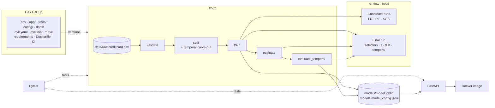
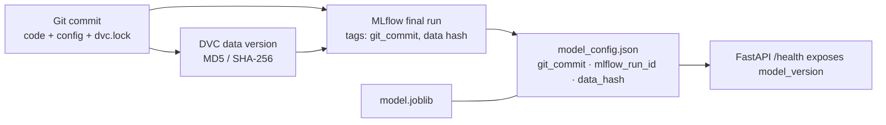
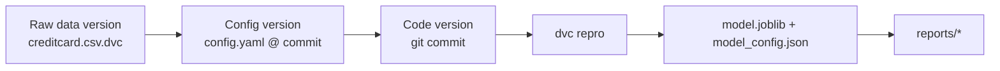
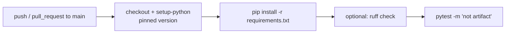
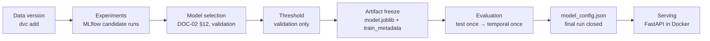

# Credit Card Fraud Detection — MLOps Design

| Field | Value |
|---|---|
| Document ID | DOC-03 |
| Status | Baseline v1.0 (Source of Truth) |
| Depends on | DOC-01 v1.1 (Requirements & Scope), DOC-02 v1.1 (Data & ML Design) — authoritative |
| Companion | DOC-04 (System, API & Deployment Design) |
| Tags | **[REQ]** requirement · **[DEC]** confirmed decision · **[PROV]** provisional · **[ASM]** assumption · **[REC]** recommendation · **[EMP]** requires empirical validation |
| Change policy | This document must not alter ML methodology. Conflicts are resolved in favour of DOC-01/DOC-02. |

**Verified dataset facts (from inspection of the supplied file):** `creditcard.csv`, 284,807 raw rows, 492 frauds, 31 columns (`Time`, `V1`–`V28`, `Amount`, `Class`), schema matches DOC-02 §2. Post-deduplication counts are produced by the `validate` stage and are **not** stated here.

---

## 1. MLOps Objectives

| ID | Objective | Mechanism |
|---|---|---|
| MO-1 | **Reproducibility** — same inputs produce the same splits, model and metrics | Git commit + DVC data hash + `config/config.yaml` + pinned deps + global seed |
| MO-2 | **Traceability** — every artifact answers "which code, data, config produced me?" | Lineage fields in `model_config.json`, MLflow tags, `dvc.lock` |
| MO-3 | **Data versioning** | DVC tracks raw CSV and all pipeline data outputs |
| MO-4 | **Experiment tracking** | MLflow local tracking: candidate runs + one final run |
| MO-5 | **Configuration management** | Single `config/config.yaml`, used as DVC params |
| MO-6 | **Model artifact lineage** | `model.joblib` + `model_config.json` linked to commit, data hash, MLflow run ID |
| MO-7 | **Testing** | Pytest: data, leakage, threshold, artifact, inference, API |
| MO-8 | **Deployment handoff** | Frozen artifacts in `models/` are the only interface consumed by FastAPI/Docker (DOC-04) |

## 2. MLOps Architecture



Everything runs locally on one machine. No remote tracking server, orchestrator, or cloud service is used. **[DEC]**

## 3. Git / GitHub Strategy

**Tracked by Git [DEC]**

| Item | Path |
|---|---|
| Source code | `src/`, `app/` |
| Tests | `tests/` |
| Configuration | `config/config.yaml` |
| Documentation | `docs/`, `README.md` |
| DVC metadata | `dvc.yaml`, `dvc.lock`, `data/raw/creditcard.csv.dvc`, `.dvc/config`, `.dvcignore` |
| Dependencies | `requirements.txt`, `requirements-serve.txt` |
| Container | `Dockerfile`, `.dockerignore` |
| CI (optional) | `.github/workflows/ci.yml` |
| Small human-readable reports | `reports/**/*.json`, `reports/**/*.csv`, `reports/**/*.md` — **only if** declared as DVC `metrics`/`plots` with `cache: false`; otherwise DVC-managed |

**Not tracked by Git [DEC]** (via `.gitignore`):

| Item | Managed by |
|---|---|
| `data/raw/creditcard.csv` | DVC (`dvc add`) |
| `data/interim/`, `data/processed/` | DVC pipeline outputs |
| `models/*.joblib`, `models/candidates/` | DVC pipeline outputs (+ copy in MLflow) |
| `mlruns/`, `mlflow.db` | MLflow local store |
| Figures (`*.png`) | DVC outputs + MLflow artifacts |
| `.venv/`, caches, `.dvc/cache` | Local only |

**Branch/commit strategy [DEC]**
- Single long-lived branch `main`. Short-lived feature branches (e.g., `feat/api`) are optional; merge by fast-forward or a single PR if CI is enabled. No GitFlow.
- Small, descriptive commits using a light prefix convention: `data:`, `feat:`, `test:`, `docs:`, `config:`, `ci:`.
- After every successful `dvc repro`, commit `dvc.lock` together with the code/config that produced it — this commit is the reproducibility anchor.
- Annotated tags at milestones **[REC]**: `v0.1-data` (validated + split), `v1.0-model` (final model frozen), `v1.0-serve` (API + Docker working).

## 4. DVC Strategy

### 4.1 Data versioning
- Raw data path: **`data/raw/creditcard.csv`** **[DEC]**, registered with `dvc add` → `data/raw/creditcard.csv.dvc` (MD5) committed to Git.
- The raw file is **immutable**. A different file is a new data version: re-run `dvc add`, commit the new `.dvc` file, re-run the pipeline.
- **DVC remote [PROV]:** a local directory outside the repo (e.g., `../dvc-storage`) configured as default remote. No cloud remote. If the remote is unavailable, an engineer may re-download the public CSV; `dvc status` confirms the MD5 matches.
- **Provenance:** two hashes are recorded — DVC's MD5 (in `.dvc`/`dvc.lock`) and the SHA-256 required by DOC-02 §15 (`data_hash` in `model_config.json`, computed by `validate`). Both appear in the final MLflow run.

**Git ↔ data relationship:** a Git commit pins the `.dvc` file and `dvc.lock`, which pin the exact data and every intermediate output. `git checkout <commit> && dvc checkout` restores the matching data/model state.

### 4.2 Pipeline stages (conceptual; `dvc.yaml` written at implementation)

All stages read parameters from `config/config.yaml` via DVC `params`. Each stage is one CLI entry point, e.g. `python -m fraud_detection.pipeline.<stage>`.

| # | Stage | Deps (code + data) | Params (config keys) | Outputs |
|---|---|---|---|---|
| 1 | `validate` | `data/raw/creditcard.csv`, `src/.../data/validate.py` | `paths`, `schema`, `seed` | `data/interim/clean.csv` (validated + deduplicated), `reports/validation_report.json` (incl. SHA-256, raw/dedup counts per class) |
| 2 | `split` | `data/interim/clean.csv`, `src/.../data/split.py` | `ordering_column`, `temporal.holdout_fraction`, `split.*`, `seed` | `data/processed/{train,val,test}.csv`, `data/processed/temporal_holdout.csv`, `reports/split_summary.json`, `reports/temporal/temporal_split_summary.json` |
| 3 | `train` | `train.csv`, `val.csv`, `src/.../features/`, `src/.../models/` | `features`, `models.*`, `imbalance.*`, `tuning.*`, `threshold.*`, `seed` | `models/candidates/{lr,rf,xgb}.joblib`, `models/model.joblib`, `models/train_metadata.json`, `reports/model_comparison.csv`, `reports/threshold_analysis_<model>.csv` + plots, `reports/model_selection.md` |
| 4 | `evaluate` | `models/model.joblib`, `models/train_metadata.json`, `test.csv` | `evaluation.*` | `reports/test_metrics.json`, `reports/figures/test_confusion_matrix.png` |
| 5 | `evaluate_temporal` | `models/model.joblib`, `models/train_metadata.json`, `temporal_holdout.csv`, `reports/test_metrics.json` | `evaluation.*`, `temporal.*` | `reports/temporal/{temporal_metrics.json, temporal_vs_random_comparison.csv, temporal_confusion_matrix.png, temporal_robustness.md}`, `models/model_config.json` (final) |

**Stage rules**
- `train` performs everything DOC-02 assigns to train/validation: CV tuning on train, validation comparison, model selection, threshold optimization, and freezing. It **must not** list `test.csv` or `temporal_holdout.csv` as dependencies — DVC's dependency graph then structurally enforces DOC-02 §5 and §21.4. **[DEC]**
- `evaluate` does not depend on `temporal_holdout.csv`; `evaluate_temporal` runs after `evaluate` (DOC-02 §14 step 7).
- `evaluate` and `evaluate_temporal` read the frozen threshold from `train_metadata.json`; neither writes back to `model.joblib` or changes τ.
- `reports/*metrics.json` are declared as DVC `metrics` (enables `dvc metrics show/diff`); threshold CSVs as DVC `plots` **[REC]**.
- EDA (`reports/eda/`) is a manually run script/notebook, not a DVC stage — it is descriptive only and feeds no pipeline decision. **[DEC]**

**Why two metadata files (`train_metadata.json` → `model_config.json`)** **[DEC]:** DVC forbids one file being the output of two stages. `train` freezes model identity, feature order and threshold in `train_metadata.json` *before* any test data is seen (satisfying DOC-02 §14 step 2). The final stage merges it with test and temporal metrics into the `model_config.json` schema defined in DOC-02 §15. Threshold, feature order and model identity are copied verbatim; nothing is recomputed. Serving reads only `model_config.json`.

## 5. Configuration Management

`config/config.yaml` is the single source of run-time parameters **[DEC]** and is registered as DVC params.

| Section | Keys (indicative) |
|---|---|
| `project` | `model_version` base (e.g., `1.0.0`), `seed: 42` |
| `paths` | raw, interim, processed, models, reports |
| `schema` | `target: Class`, `ordering_column: Time`, `features: [V1 … V28, Amount]` (29), `required_columns` |
| `split` | `train: 0.70`, `val: 0.15`, `test: 0.15`, `stratify: true` |
| `temporal` | `holdout_fraction: 0.15`, `min_fraud_warning: 20` **[PROV]** |
| `imbalance` | `strategy: class_weight`, `smote_experiment: false` |
| `models` | enabled candidates `[logistic_regression, random_forest, xgboost]`, fixed params |
| `tuning` | `cv_folds: 3`, `n_iter`, `scoring: average_precision`, search spaces per DOC-02 §10 |
| `threshold` | `r_min: 0.80` **[PROV]**, `grid: {start: 0.01, stop: 0.99, step: 0.01}`, `fallback: f2` |
| `evaluation` | `bootstrap: {enabled: false, n: 1000}` |
| `mlflow` | `tracking_uri: file:./mlruns` (or `sqlite:///mlflow.db`), `experiment_name: credit-card-fraud-detection` |

**Must NOT be hard-coded in training or serving code [REQ]:** seed, file paths, feature list/order, target and ordering column names, split/holdout fractions, hyperparameters and search spaces, imbalance strategy, `r_min`, threshold grid, the selected threshold value, MLflow URI/experiment name. Serving takes feature order and threshold **only** from `model_config.json`, never from `config.yaml` or literals (DOC-04 §4).

Allowed constants: metric names, file-format details, and the invariant that `Time` must never appear in the feature list (asserted, not configured).

## 6. MLflow Experiment Tracking

**Setup [DEC]:** local tracking store (`file:./mlruns` default; SQLite optional), one experiment `credit-card-fraud-detection`. `mlflow ui` for inspection. No remote server, no external tracker. The MLflow Model Registry is **not** used (not needed for one model; avoids a DB backend requirement) **[DEC]**.

**Run tags on every run:** `git_commit`, `git_dirty` (bool), `data_sha256`, `data_dvc_md5`, `config_hash`, `stage`, `run_type` (`candidate` | `final`).

### 6.1 Candidate runs (stage `train`)

One run per candidate: `logistic_regression`, `random_forest`, `xgboost`, plus `smote_logistic_regression` **only if** `imbalance.smote_experiment: true` and it was actually executed.

| Type | Content |
|---|---|
| Params | `model`, best hyperparameters, search space summary, `cv_folds`, `n_iter`, `seed`, `imbalance_strategy`, `scale_pos_weight` (XGB), `n_features=29`, data identifiers |
| Metrics (validation) | `val_pr_auc`, `val_roc_auc`, `cv_best_average_precision`; at tuned τ: `val_precision`, `val_recall`, `val_f1`, `val_f2`, `val_fp`, `val_fn`, `val_threshold`; at 0.50 (reference): same set prefixed `val_ref050_` |
| Artifacts | `threshold_analysis_<model>.csv`, P/R-vs-threshold plot, validation confusion matrix, candidate `.joblib` |

### 6.2 Final run

Created in `train` after selection (`run_type=final`). Its `run_id` is written to `train_metadata.json`; `evaluate` and `evaluate_temporal` **resume** the same run by ID to append metrics and artifacts. **[DEC]**

| Type | Content |
|---|---|
| Params | `selected_model`, selected hyperparameters, `threshold`, `threshold_objective` (`recall>=r_min_max_precision` or `max_f2`), `r_min`, `seed`, `model_version`, `candidate_run_ids` |
| Metrics | `val_*` (as above), `test_*` (PR-AUC, ROC-AUC, Precision, Recall, F1, F2, FP, FN, prevalence), `temporal_*` (same set + `temporal_prevalence`, `temporal_pr_auc_lift`), `delta_*` (temporal − test) |
| Artifacts | `model.joblib`, `model_config.json`, `model_comparison.csv`, `model_selection.md`, `test_metrics.json`, test confusion matrix, all `reports/temporal/*`, `validation_report.json`, `config.yaml` snapshot, `requirements.txt` |

### 6.3 Responsibility boundaries

| Concern | Owner | Notes |
|---|---|---|
| Experiment tracking (what was tried, results) | **MLflow** | Queryable history; comparison UI |
| Model artifact storage (what gets served) | **DVC output `models/`** | Canonical serving source; MLflow holds a copy for lineage only |
| Model selection (which model wins) | **Pipeline code in `train`**, per DOC-02 §12 | Deterministic, recorded in `model_selection.md`; never a manual MLflow UI choice |

## 7. Model Artifact and Lineage

Artifacts are exactly those frozen in DOC-02 §15:
- **`models/model.joblib`** — complete fitted sklearn Pipeline (ColumnTransformer + classifier; imblearn Pipeline only if the SMOTE variant is selected).
- **`models/model_config.json`** — DOC-02 §15 schema: `model_name`, `model_version`, `threshold`, `threshold_objective`, `feature_order` (29), `ordering_column: "Time"`, `temporal_holdout_fraction`, `target`, `positive_label`, `trained_at`, `random_seed`, `data_hash`, `library_versions`, `validation_metrics`, `test_metrics`, `temporal_holdout_metrics`.

**Lineage additions [DEC]** (extra keys, additive to DOC-02 §15, used for traceability only): `git_commit`, `mlflow_run_id`, `data_dvc_md5`, `config_hash`, `python_version`.

`model_version` = `<project.model_version>+<git short SHA>` (e.g., `1.0.0+a1b2c3d`) **[DEC]**.



Any served prediction → `model_version` → Git commit + MLflow run → data hash → exact raw file.

## 8. Pipeline Reproducibility



**Reproduction procedure (another engineer) [DEC]**
1. `git clone` and `git checkout <tag or commit>` (e.g., `v1.0-model`).
2. Create a venv with the recorded Python version; `pip install -r requirements.txt` (pinned).
3. `dvc pull` — or place the public `creditcard.csv` at `data/raw/` and confirm `dvc status` reports no change.
4. `dvc repro` (runs all five stages; skipped stages are already up to date).
5. Verify: `dvc status` clean; `dvc metrics diff` against the committed `dvc.lock` shows no change beyond float tolerance; `model_config.json` has the same `threshold` and `data_hash`.

**Expected determinism:** splits identical (seeded); metrics identical or within floating-point tolerance (DOC-01 SC-09; DOC-02 §16). `git_dirty=true` runs are not considered reproducible releases.

## 9. Testing Strategy

Pytest, lightweight, focused on correctness guarantees rather than coverage percentage **[DEC]**. Tests use **small synthetic fixtures** so they run without the raw dataset; tests needing real DVC outputs are marked `@pytest.mark.artifact` and skipped when absent.

| Area | Test | File |
|---|---|---|
| Dataset validation | Missing file → error; ±inf → hard fail; negative `Amount`/`Time` → hard fail | `test_validation.py` |
| Schema | Missing required column → fail; unexpected column → warning + dropped from features | `test_validation.py` |
| Target | Values outside {0,1} or single class → fail | `test_validation.py` |
| Duplicates | Exact duplicates removed, first kept, count reported | `test_validation.py` |
| Split ratios | 70/15/15 of pool within rounding; stratified prevalence within tolerance (DOC-01 SC-02) | `test_split.py` |
| Temporal carve-out | Holdout = latest ~15%; `max(Time_pool) ≤ min(Time_holdout)`; boundary ties go to holdout | `test_split.py` |
| Zero overlap | No row shared among train / val / test / temporal holdout | `test_split.py` |
| Leakage rules | Preprocessor fitted on train only (scaler stats equal train stats); `train` entrypoint never reads test/holdout paths; SMOTE (if used) changes only train size | `test_leakage.py` |
| Threshold selection | Known P/R curve → correct τ for `recall>=r_min` rule; fallback to F2 when unattainable; tie → higher τ | `test_threshold.py` |
| Feature order | `feature_order` == 29 features, `Time` absent; reordered input produces identical predictions after enforcement | `test_inference.py` |
| Artifact round-trip | Save → load pipeline + config → identical probabilities | `test_artifacts.py` |
| Inference | FR-016 function returns probability ∈ [0,1], class ∈ {0,1}, threshold from config | `test_inference.py` |
| API | Covered in DOC-04 §12 | `test_api.py` |

## 10. Optional CI (GitHub Actions)

**[PROV — optional]** One workflow `.github/workflows/ci.yml`:



No DVC pull, no training, no Docker build/push, no deployment in CI. **[DEC]**

## 11. Repository Structure

```text
.
├── config/config.yaml
├── data/
│   ├── raw/creditcard.csv            # DVC (git-ignored); creditcard.csv.dvc in Git
│   ├── interim/clean.csv             # DVC output
│   └── processed/{train,val,test,temporal_holdout}.csv
├── docs/01_…04_*.md
├── src/fraud_detection/
│   ├── config.py                     # load/validate config.yaml
│   ├── data/{validate.py, split.py}
│   ├── features/preprocess.py        # ColumnTransformer factory
│   ├── models/{train.py, tuning.py, select.py}
│   ├── evaluation/{metrics.py, threshold.py, evaluate.py, evaluate_temporal.py}
│   ├── tracking/mlflow_utils.py
│   ├── inference/predictor.py        # FR-016; no training imports
│   └── pipeline/                     # DVC stage entrypoints
├── app/{main.py, schemas.py}         # FastAPI (DOC-04)
├── models/{model.joblib, model_config.json, train_metadata.json, candidates/}
├── reports/{eda/, figures/, temporal/, *.json, *.csv, model_selection.md}
├── notebooks/eda.ipynb               # optional; descriptive only
├── tests/
├── dvc.yaml · dvc.lock · .dvcignore
├── requirements.txt                  # full (train + test + serve)
├── requirements-serve.txt            # inference only
├── Dockerfile · .dockerignore
├── .github/workflows/ci.yml          # optional
└── README.md
```

**Import rule [DEC]:** `inference/` and `app/` must not import from `data/`, `models/`, `evaluation/`, `tracking/`, or `pipeline/`, so the serving image can omit training code (DOC-04 §8).

## 12. MLOps Workflow / Lifecycle



Temporal results flow only forward into reports and metadata; no arrow returns to B–D. **[DEC]**

## 13. Failure / Reproducibility Scenarios

| Scenario | Detection | Response |
|---|---|---|
| Dataset changed | `dvc status` shows changed raw MD5; SHA-256 differs from `model_config.json` | Treat as new data version: `dvc add`, commit, full `dvc repro`, new `model_version` |
| Schema changed | `validate` hard-fails (DOC-02 §3) | Stop. Update `schema` in config only if change is legitimate; record in decision log; `Time` must still be excluded |
| Config changed | DVC params diff marks dependent stages stale | `dvc repro` reruns only affected stages; commit config + `dvc.lock` together |
| Dependency changed | Pinned versions differ from `library_versions` in config | Reinstall pinned deps; if upgrade intended, retrain and re-release. API refuses mismatched sklearn/xgboost (DOC-04 §4) |
| Model artifact mismatch | `model.joblib` not produced with current `model_config.json` (hash/run ID mismatch; `dvc status` stale) | Do not serve; `dvc repro` / `dvc checkout` to restore consistent pair |
| Threshold mismatch | τ in `model_config.json` ≠ τ in `train_metadata.json` or MLflow final run | Test fails; regenerate via `evaluate_temporal`; never hand-edit τ |
| Stale MLflow run | Run's `git_commit`/`data_sha256` ≠ current `model_config.json` | Treat MLflow as history only; the DVC-tracked artifact is canonical; re-run pipeline to create a fresh final run |
| Missing DVC-tracked data | `dvc pull` fails / file absent | Re-download public CSV to `data/raw/`; `dvc status` must match recorded MD5, else it is a different version |
| Temporal holdout touched by training | `train` stage deps include holdout, or leakage test fails | Build fails; fix pipeline — this is a methodology violation (DOC-02 §21.4) |

## 14. MLOps Acceptance Criteria (gate before deployment)

| ID | Check | Pass condition |
|---|---|---|
| MAC-01 | Git clean | `git status` clean; `dvc.lock` committed with producing code/config |
| MAC-02 | DVC clean | `dvc status` reports all stages up to date |
| MAC-03 | Full reproduction | `dvc repro --force` from clean checkout reproduces splits and metrics within tolerance |
| MAC-04 | Stage isolation | `train` deps exclude `test.csv` and `temporal_holdout.csv` (inspect `dvc.yaml`) |
| MAC-05 | MLflow | 3 candidate runs (+1 if SMOTE run) and 1 final run exist, with `git_commit` and `data_sha256` tags matching `model_config.json` |
| MAC-06 | Artifacts | `model.joblib` and `model_config.json` exist; config contains all DOC-02 §15 keys + lineage keys; `feature_order` has 29 entries without `Time` |
| MAC-07 | Reports | `test_metrics.json`, `reports/temporal/*` and `model_selection.md` exist and contain no placeholder values |
| MAC-08 | Tests | `pytest` passes (including `artifact`-marked tests locally) |
| MAC-09 | Deps | `requirements.txt` and `requirements-serve.txt` fully pinned; serve versions of sklearn/xgboost/joblib/numpy identical to training |

## 15. Decision Log

| ID | Decision | Status |
|---|---|---|
| MD-01 | All tooling local; no remote tracking server, cloud remote, or orchestrator | Confirmed |
| MD-02 | Single `main` branch, optional short-lived feature branches, milestone tags | Confirmed |
| MD-03 | Raw data at `data/raw/creditcard.csv` via `dvc add`; immutable | Confirmed |
| MD-04 | DVC remote = local directory | Provisional |
| MD-05 | Five DVC stages: validate → split → train → evaluate → evaluate_temporal | Confirmed |
| MD-06 | `train` has no dependency on test/holdout data (structural leakage guard) | Confirmed |
| MD-07 | `train_metadata.json` freezes τ before test; final stage assembles `model_config.json` | Confirmed |
| MD-08 | `config/config.yaml` single parameter source, used as DVC params | Confirmed |
| MD-09 | MLflow local store, one experiment, candidate runs + one resumed final run; no Model Registry | Confirmed |
| MD-10 | DVC `models/` is the canonical serving artifact; MLflow copy is for lineage | Confirmed |
| MD-11 | Selection automated in code per DOC-02 §12; never manual via UI | Confirmed |
| MD-12 | Lineage keys added to `model_config.json` (additive to DOC-02 §15) | Confirmed |
| MD-13 | `model_version = <semver>+<git short SHA>` | Confirmed |
| MD-14 | Tests on synthetic fixtures; real-artifact tests marked and optional | Confirmed |
| MD-15 | GitHub Actions: install + pytest (+ optional lint) only | Provisional (optional) |
| MD-16 | EDA outside DVC pipeline | Confirmed |
| MD-17 | Split requirements into full vs serve files with identical shared pins | Confirmed |
| MD-18 | Exact pinned versions and Python version | Deferred to implementation **[EMP]** |
