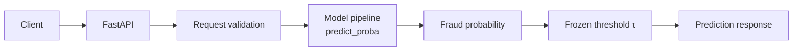
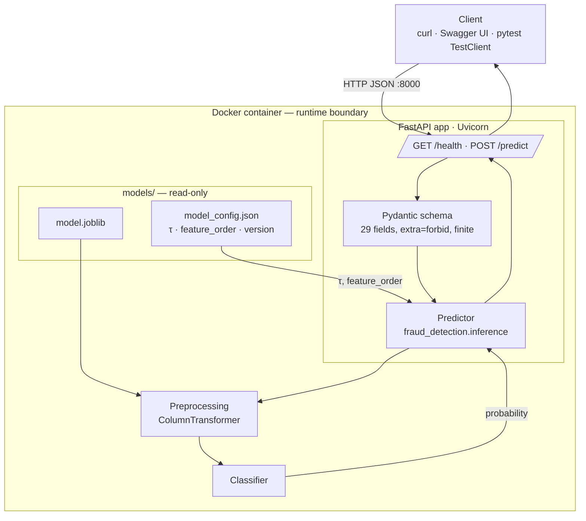
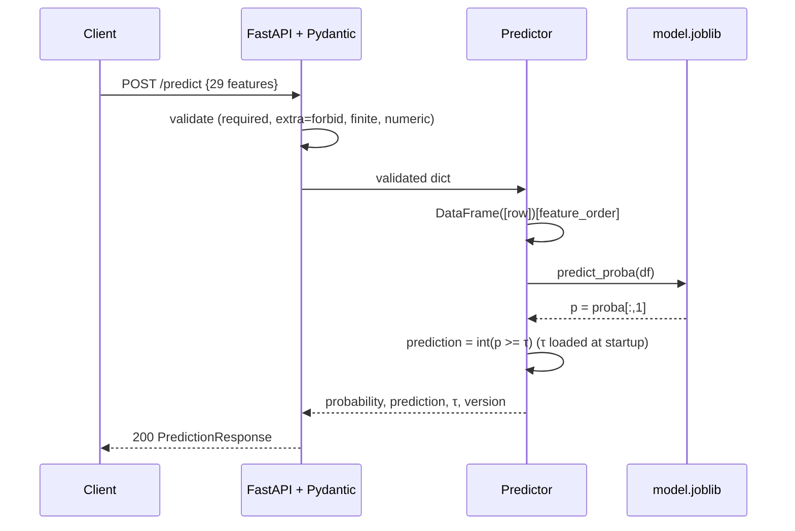

# Credit Card Fraud Detection — System, API & Deployment Design

| Field | Value |
|---|---|
| Document ID | DOC-04 |
| Status | Baseline v1.0 (Source of Truth) |
| Depends on | DOC-01 v1.1, DOC-02 v1.1 (authoritative), DOC-03 v1.0 |
| Tags | **[REQ]** · **[DEC]** confirmed · **[PROV]** provisional · **[ASM]** assumption · **[REC]** recommendation · **[EMP]** empirical |
| Scope | Serving the **frozen** model locally via FastAPI, packaged with Docker. No training, tuning, or threshold changes occur at serving time. |

---

## 1. System Overview

A single-process FastAPI service loads the frozen artifacts produced by the DVC pipeline (DOC-03) and scores one transaction per request.



The service is stateless apart from the artifacts loaded at startup. It implements FR-016 over HTTP and the conceptual I/O of DOC-01 §8.

## 2. System Architecture



## 3. Component Responsibilities

| Component | Responsibility | Not responsible for |
|---|---|---|
| FastAPI (`app/main.py`) | Routing, startup loading, HTTP status codes, OpenAPI docs | Business logic, preprocessing |
| Pydantic (`app/schemas.py`) | Enforce exactly 29 finite numeric fields; forbid extras; response model | Scaling/imputation |
| Predictor (`src/fraud_detection/inference/predictor.py`) | Load + verify artifacts; build DataFrame in `feature_order`; `predict_proba`; apply τ | Training, threshold tuning |
| `model.joblib` | All preprocessing + classifier (single source of transformation logic) | Threshold |
| `model_config.json` | Threshold, feature order, model identity/version, lineage | Model weights |
| Docker | Reproducible runtime with pinned serve dependencies + artifacts | Training, data |
| Tests (`tests/test_api.py`, `test_inference.py`) | Verify contract, validation, and artifact behaviour | Model quality (covered by DOC-02 reports) |

## 4. Model Loading

Loading happens **once at application startup** (FastAPI lifespan handler). **No retraining, refitting, or threshold recomputation ever occurs in the service. [REQ]**

Artifact paths are read from environment variables with defaults: `MODEL_PATH=models/model.joblib`, `MODEL_CONFIG_PATH=models/model_config.json` **[DEC]**.

Startup checks, in order (**fail fast**: log a clear error and exit non-zero; the service never runs half-loaded) **[DEC]**:

| # | Check | Failure message (logged) |
|---|---|---|
| 1 | Both files exist and are readable | `Model artifact not found at <path>` |
| 2 | `model_config.json` parses and has required keys (`model_name`, `model_version`, `threshold`, `feature_order`, `library_versions`) | `Model config invalid: missing <key>` |
| 3 | `feature_order` has 29 unique names, equals the API schema field set, and does **not** contain `Time` | `Feature schema incompatible` |
| 4 | `0 < threshold < 1` | `Invalid threshold in config` |
| 5 | Runtime scikit-learn / xgboost versions equal `library_versions` (major.minor.patch) | `Library version mismatch: <lib>` |
| 6 | `joblib.load` succeeds and object exposes `predict_proba` | `Model artifact corrupt or incompatible` |
| 7 | If the pipeline exposes `feature_names_in_`, it equals `feature_order` | `Feature schema incompatible` |
| 8 | Smoke prediction on a zero-vector in `feature_order` returns a probability in [0,1] | `Model self-check failed` |

Rationale for fail-fast rather than a degraded "unhealthy" mode: in a single-model demo service there is nothing useful to serve without the model, and Docker/HTTP clients see an unambiguous failure.

## 5. API Contract

Base URL (local): `http://localhost:8000`. JSON only. Single-transaction scoring only; batch endpoints are out of scope **[DEC]**.

### 5.1 `GET /health`

`200 OK`:
```json
{ "status": "ok", "model_loaded": true, "model_name": "<from config>", "model_version": "<from config>" }
```
Because startup fails fast, a responding service always has the model loaded.

### 5.2 `POST /predict`

**Request body** — exactly these 29 keys, all required, JSON numbers **[REQ]**:

`V1, V2, …, V28, Amount`

```json
{ "V1": -1.36, "V2": -0.07, "...": 0.0, "V28": -0.02, "Amount": 149.62 }
```
(Illustrative values only.)

- `Time` is **not** accepted. Sending it is an "extra field" error (§5.3). **[REQ]**
- `Class` is never accepted.
- Field order in JSON is irrelevant; the server reorders using `feature_order`.

**Response `200 OK`:**
```json
{
  "fraud_probability": 0.0123,
  "prediction": 0,
  "label": "legitimate",
  "threshold": 0.00,
  "model_name": "<selected model>",
  "model_version": "<semver+sha>"
}
```
| Field | Type | Meaning |
|---|---|---|
| `fraud_probability` | float ∈ [0,1] | `predict_proba[:, 1]` |
| `prediction` | int ∈ {0,1} | `1` iff `fraud_probability ≥ threshold` |
| `label` | `"fraud"` \| `"legitimate"` | Human-readable form of `prediction` |
| `threshold` | float | Frozen τ from `model_config.json` (value above is a placeholder, not a result) |
| `model_name`, `model_version` | string | From `model_config.json` |

### 5.3 Validation behaviour

| Case | Rule | Status |
|---|---|---|
| Missing feature | All 29 required | `422` |
| Extra field (incl. `Time`, `Class`) | `extra="forbid"` | `422` |
| Non-numeric value (string, bool, null, object) | Strict numeric types; numeric strings like `"1.2"` rejected | `422` |
| Non-finite (`NaN`, `Infinity`) | `allow_inf_nan=False` | `422` |
| Negative `Amount` | `Amount ≥ 0` (mirrors DOC-02 §3 hard-fail rule) | `422` |
| Malformed JSON / wrong content type | FastAPI default | `422` |
| Wrong method / unknown path | FastAPI default | `405` / `404` |

`422` responses use FastAPI's standard `{"detail": [...]}` structure, identifying field names but not echoing internal details. No range checks are placed on `V1`–`V28` (anonymized; no justified bounds, DOC-02 §2) **[DEC]**.

## 6. Inference Flow



**Train/serve parity [DEC]:** the service performs **no** transformation of its own — scaling and imputation live inside `model.joblib` (DOC-02 §7, §15). The only serving-side operations are schema validation, column ordering, and the `≥ τ` comparison, identical to the rule used in `evaluate` and `evaluate_temporal`. The comparison operator (`≥`) is shared code in `fraud_detection.inference` so evaluation and serving cannot diverge.

## 7. Error Handling

| Situation | When | Behaviour |
|---|---|---|
| Missing model / config | Startup | Log explicit error, exit non-zero; container stops |
| Corrupted model / config | Startup | Same |
| Incompatible feature schema or library version | Startup | Same |
| Invalid request | Request | `422` with field-level detail |
| Inference failure (unexpected exception) | Request | `500` `{"detail": "Prediction failed"}`; full traceback logged server-side only |

Responses never include stack traces, file paths, library versions, or model internals. Request feature values are not written to logs **[DEC]**.

## 8. Docker Design (specification; Dockerfile written at implementation)

| Aspect | Decision |
|---|---|
| Base image | Official `python:<X.Y>-slim`, where `X.Y` equals the training Python version recorded in `model_config.json` **[DEC]**; exact tag pinned **[EMP]** |
| Working dir | `/app` |
| Dependencies | `pip install --no-cache-dir -r requirements-serve.txt` (pinned: fastapi, uvicorn, pydantic, scikit-learn, xgboost, numpy, pandas, joblib; `imbalanced-learn` **only if** the selected pipeline is an imblearn Pipeline). Versions identical to training (DOC-03 MAC-09) |
| Code copied | `app/`, `src/fraud_detection/__init__.py`, `src/fraud_detection/inference/`; `PYTHONPATH=/app/src` |
| Artifacts copied | `models/model.joblib`, `models/model_config.json` only |
| Excluded (`.dockerignore`) | `data/`, `mlruns/`, `mlflow.db`, `reports/`, `notebooks/`, `tests/`, `models/candidates/`, `.dvc/`, `.git/`, `.venv/`, training modules |
| User | Non-root user **[REC]** |
| Port | `EXPOSE 8000` |
| Startup | `uvicorn app.main:app --host 0.0.0.0 --port 8000` (single worker) |
| Healthcheck | Optional Docker `HEALTHCHECK` calling `/health` via Python stdlib (no curl needed in slim) **[REC]** |

**Build precondition:** `models/` must be populated first (`dvc repro` or `dvc pull`); the build does not run DVC or training. The raw dataset is **never** in the image **[REQ]**. `mlflow` and `dvc` are not serving dependencies.

## 9. Local Deployment

**Docker (primary demo path)**
```bash
dvc pull            # or: dvc repro   → ensures models/ is populated
docker build -t fraud-detector:<model_version> .
docker run --rm -p 8000:8000 fraud-detector:<model_version>
curl http://localhost:8000/health
# browse http://localhost:8000/docs  → try POST /predict
```

**Non-Docker (debugging)**
```bash
pip install -r requirements.txt
uvicorn app.main:app --reload --port 8000
```
Both paths load the same artifacts from `models/`; behaviour must be identical.

## 10. API Documentation

FastAPI's generated OpenAPI docs are sufficient **[DEC]**: Swagger UI at `/docs`, ReDoc at `/redoc`, schema at `/openapi.json`. Pydantic models carry field descriptions and one example request (a real-looking row whose values are clearly labelled illustrative). No frontend is built.

## 11. Security / Reliability Basics

| Concern | Measure |
|---|---|
| Input validation | Strict Pydantic schema (§5.3) |
| Secrets | None required; none in source, image, or config |
| Data persistence | API stores nothing; request payloads are not logged or saved |
| Error hygiene | Generic 500 message; no internals exposed (§7) |
| Determinism | Frozen artifact + fixed τ → same input, same output |
| Liveness | `/health`; fail-fast startup |
| Container | Non-root user, minimal image contents |
| Authentication | **Not implemented** — local demo service, no sensitive data; would be required before any real exposure (§14) **[DEC]** |

## 12. Service Testing Strategy (Pytest + FastAPI `TestClient`)

API tests use a **fixture artifact pair** (tiny pipeline trained on synthetic 29-feature data + matching config) injected via `MODEL_PATH`/`MODEL_CONFIG_PATH`, so they run in CI without DVC data. One `@pytest.mark.artifact` smoke test uses the real `models/` when present.

| Test | Expectation |
|---|---|
| Health | `200`, `model_loaded: true`, version equals config |
| Valid prediction | `200`; response matches schema |
| Probability range | `0 ≤ fraud_probability ≤ 1` |
| Returned threshold | Equals `model_config.json` τ |
| Decision rule | `prediction == int(fraud_probability >= threshold)`; `label` consistent |
| Invalid payload (string / null / bool) | `422` |
| Missing feature | `422` naming the field |
| Extra feature (`Time`, `Class`, arbitrary) | `422` |
| Non-finite (`NaN`, `Infinity`) | `422` |
| Negative `Amount` | `422` |
| Field-order independence | Shuffled JSON keys → identical response |
| Artifact loading | Missing / corrupt model or config, bad `feature_order`, `Time` in `feature_order` → startup raises |
| Response schema | Exactly the documented fields and types |
| Parity (`artifact` mark) | API probability for a test-set row equals `pipeline.predict_proba` offline |

## 13. Deployment Readiness Checklist

| ID | Area | Pass condition |
|---|---|---|
| DR-01 | MLOps gate | DOC-03 MAC-01…MAC-09 all pass |
| DR-02 | Local service | `uvicorn` starts; `/health` 200; `/docs` renders |
| DR-03 | Artifact loading | All §4 startup checks pass with real artifacts; deliberate removal of `model.joblib` causes a clear startup failure |
| DR-04 | API prediction | A real test-set row returns a valid response; τ equals `model_config.json`; `Time` in payload → 422 |
| DR-05 | Docker service | Image builds from clean checkout (after `dvc pull`); container `/health` 200 and `/predict` identical to local run |
| DR-06 | Image contents | `data/`, `mlruns/`, training modules absent from image (inspect with `docker run … ls`) |
| DR-07 | Tests | `pytest` passes, including `test_api.py` |
| DR-08 | Reproducibility | Image tag and `/health` `model_version` equal `model_config.json` `model_version`, traceable to Git commit + MLflow run (DOC-03 §7) |

## 14. Future Deployment Boundary

Cloud hosting (container platform, managed registry, authentication, TLS, autoscaling, monitoring/drift detection) is a natural next step but is **outside the current 2-day scope** **[DEC]**. The Docker image and `/health` endpoint are the intended handoff points. No cloud infrastructure is designed here.

## 15. Decision Log

| ID | Decision | Status |
|---|---|---|
| DD-01 | Single FastAPI service, single-transaction scoring, no batch endpoint | Confirmed |
| DD-02 | Endpoints: `GET /health`, `POST /predict` (+ built-in `/docs`) | Confirmed |
| DD-03 | Request = exactly 29 features `V1`–`V28`, `Amount`; `Time`/`Class`/extras rejected with 422 | Confirmed |
| DD-04 | Strict numeric, finite values; `Amount ≥ 0`; no bounds on `V*` | Confirmed |
| DD-05 | Response: probability, prediction, label, threshold, model name/version | Confirmed |
| DD-06 | Artifacts loaded once at startup; fail fast on any incompatibility | Confirmed |
| DD-07 | Exact sklearn/xgboost version match enforced at startup | Confirmed |
| DD-08 | τ and feature order taken only from `model_config.json` | Confirmed |
| DD-09 | No serving-side preprocessing; decision rule `p ≥ τ` shared with evaluation code | Confirmed |
| DD-10 | Artifact paths configurable via env vars with defaults | Confirmed |
| DD-11 | Docker: python-slim matching training version, serve-only requirements, `models/` artifacts only, non-root, port 8000 | Confirmed; exact tag **[EMP]** |
| DD-12 | Raw data, MLflow store, training code excluded from image | Confirmed |
| DD-13 | No authentication (local demo); required before any real exposure | Confirmed for current scope |
| DD-14 | API tests via synthetic fixture artifacts; real-artifact parity test optional | Confirmed |
| DD-15 | Cloud deployment out of scope | Confirmed |
