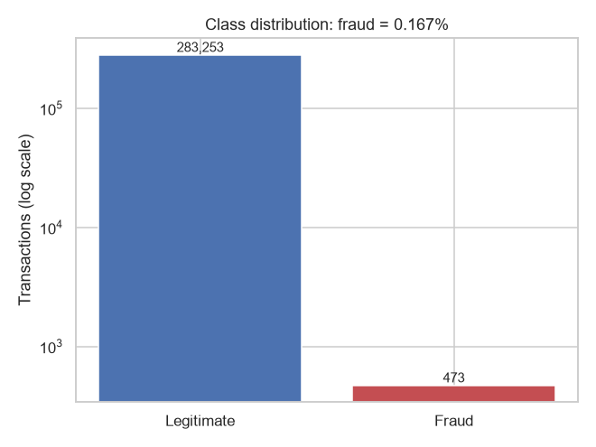
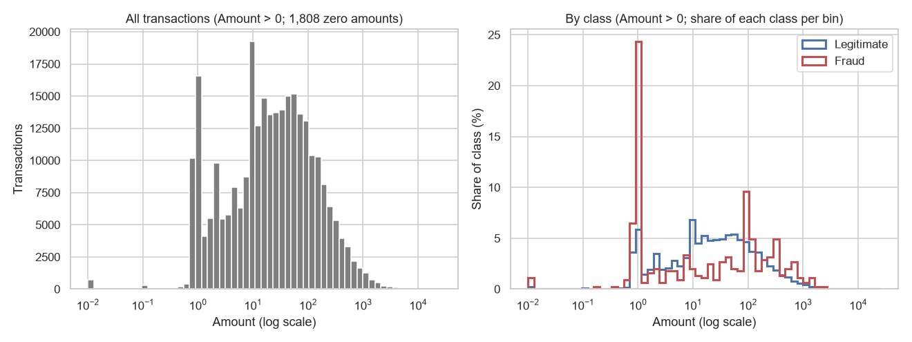
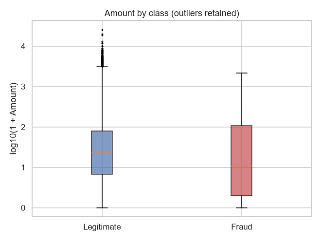
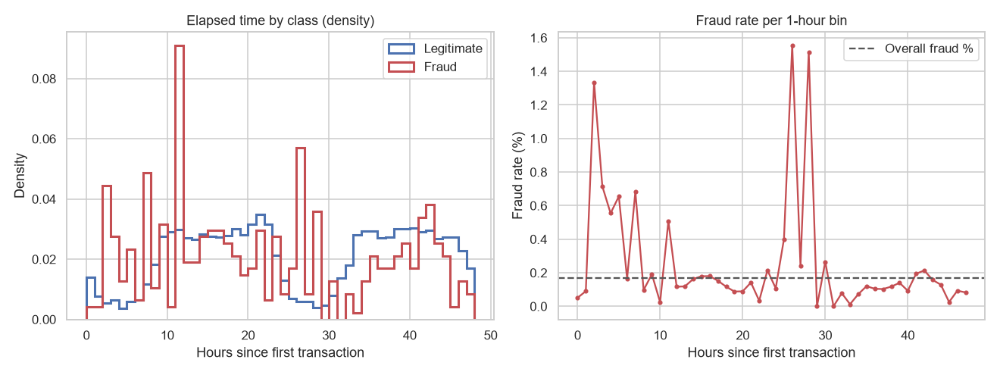
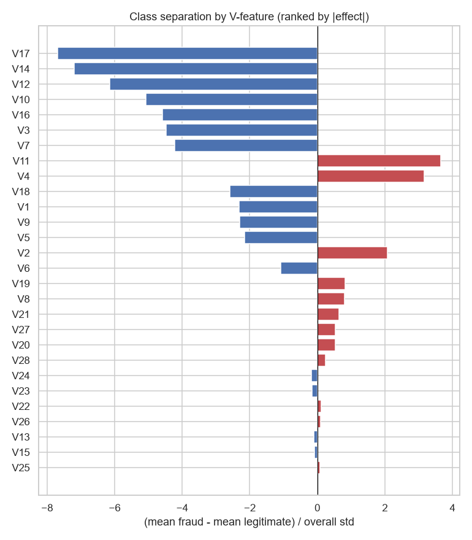
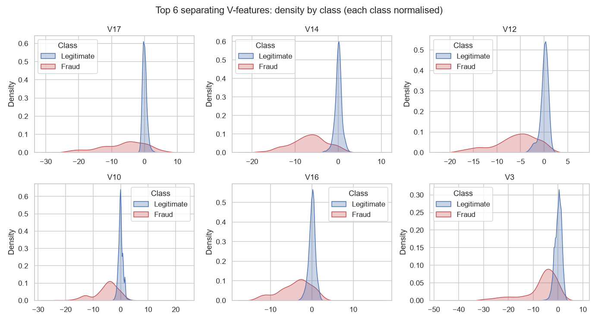
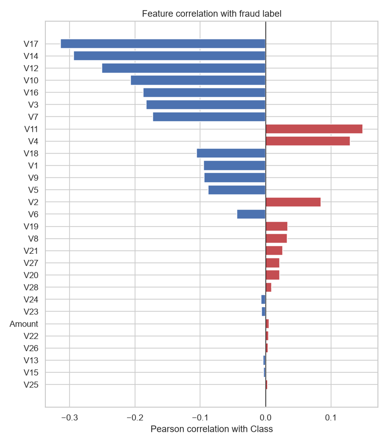
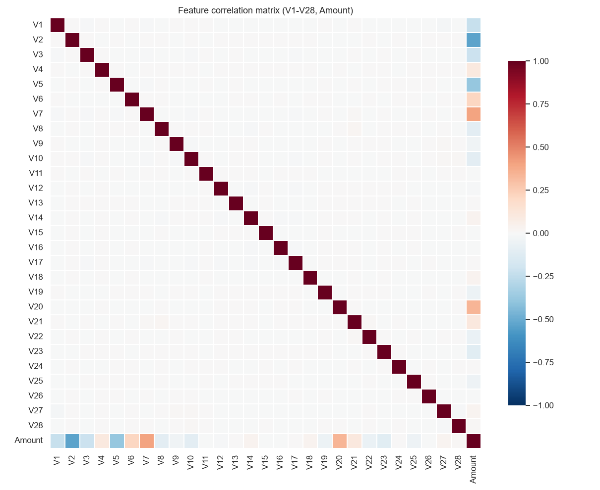

# Exploratory Data Analysis: Credit Card Fraud Detection

> Descriptive analysis of the validated, deduplicated dataset `data/interim/clean.csv`. Nothing in this report is fitted or used as a pipeline input (DOC-02 §4, DOC-03 MD-16). Regenerate with `python -m fraud_detection.eda`.

## Executive summary

The deduplicated dataset contains **283,726 transactions** spanning **48.0 hours**, of which **473 are fraudulent (0.1667%)**, about 1 fraud per 599 legitimate transactions. A model predicting "legitimate" for everything would reach 99.833% accuracy while catching no fraud, so accuracy is unusable for model selection. `Amount` is strongly right-skewed (skewness 17.0); the median fraud amount (9.82) is lower than the median legitimate amount (22.00). The anonymised features V17, V14, V12 separate the classes most strongly, and the PCA components are nearly uncorrelated with each other (max |r| = 0.019, V8–V21). Data quality is confirmed against the M1 validation report: no duplicates, missing or infinite values remain.

## Key findings

1. **Extreme imbalance:** 473 frauds vs 283,253 legitimate (ratio 1 : 599); the no-skill PR-AUC baseline equals the prevalence, 0.00167.
2. **Amount is heavy-tailed:** median 22.00, 99th percentile 1,018.97, max 25,691.16; skewness 17.0 falls to 0.16 after `log1p`.
3. **Fraud amounts differ in shape, not just level:** fraud median 9.82 vs legitimate 22.00; fraud mean 123.87 vs 88.41; 5.3% of frauds have `Amount = 0` (legitimate: 0.6%).
4. **Strong class signal in V-features:** 20 of 28 V-features have a standardized mean difference ≥ 0.5 in magnitude; the largest is V17 (-7.68 σ). Highest |correlation| with `Class`: V17 (r = -0.313), V14 (r = -0.293), V12 (r = -0.251).
5. **Low collinearity among PCA components:** max |r| between V-features is 0.019 (V8–V21). `Amount` is the only notably correlated variable (strongest with V2, r = -0.533).
6. **Scale differs sharply:** `Amount` variance is 16,523× the largest V-feature variance (V1); V-feature variances span a 35.3× range.
7. **Fraud rate varies over the capture window:** per-bin fraud rate ranges from 0.000% to 1.556% (median 0.125%) across 48 bins, so a chronological holdout's prevalence may differ from the overall rate.

## 1. Dataset overview

| Property | Value |
|---|---|
| Rows | 283,726 |
| Columns | 31 |
| Data types | float64 × 30, int64 × 1 |
| In-memory size (deep) | 67.1 MB |

Column data types

| Column | dtype |
|---|---|
| Time | float64 |
| V1 | float64 |
| V2 | float64 |
| V3 | float64 |
| V4 | float64 |
| V5 | float64 |
| V6 | float64 |
| V7 | float64 |
| V8 | float64 |
| V9 | float64 |
| V10 | float64 |
| V11 | float64 |
| V12 | float64 |
| V13 | float64 |
| V14 | float64 |
| V15 | float64 |
| V16 | float64 |
| V17 | float64 |
| V18 | float64 |
| V19 | float64 |
| V20 | float64 |
| V21 | float64 |
| V22 | float64 |
| V23 | float64 |
| V24 | float64 |
| V25 | float64 |
| V26 | float64 |
| V27 | float64 |
| V28 | float64 |
| Amount | float64 |
| Class | int64 |

## 2. Data quality (M1 reconciliation)

| Check | Result |
|---|---|
| Duplicate rows remaining | 0 |
| Missing values | 0 |
| Infinite values | 0 |
| M1 validation status | PASS |
| M1 raw rows / frauds | 284,807 / 492 |
| M1 duplicates removed | 1,081 |
| M1 clean rows / frauds | 283,726 / 473 |
| Clean rows match M1 report | yes |
| Raw data SHA-256 | `76274b691b16a6c49d3f159c883398e03ccd6d1ee12d9d8ee38f4b4b98551a89` |

Duplicates were removed in M1 before any split (DOC-02 §3 duplicate policy), which prevents identical rows straddling train and test. Outliers were deliberately kept.

## 3. Class distribution and fraud imbalance

| Metric | Value |
|---|---|
| Fraud (Class = 1) | 473 |
| Legitimate (Class = 0) | 283,253 |
| Fraud percentage | 0.1667% |
| Imbalance ratio (legitimate : fraud) | 598.8 : 1 |
| Accuracy of always predicting legitimate | 99.833% |

*Class counts (log scale)*

**Fraud imbalance insights**

- Accuracy is uninformative: the trivial classifier scores 99.833%. Model selection uses PR-AUC, with Precision/Recall/F1/F2 at a tuned threshold (DOC-02 §11–13).
- The PR-AUC of a random classifier equals the prevalence (0.00167); reported PR-AUC must be read against this baseline (DOC-01 SC-06).
- The threshold must be tuned on validation data: with this prior, predicted probabilities concentrate near 0 and the default 0.50 is unlikely to be a good operating point.
- Stratification is essential. If prevalence were uniform, the development pool (earlier 85%) would hold ≈ 402 frauds and each 15% validation/test split ≈ 60, so one fraud ≈ 1.7 pp of recall.

## 4. Transaction amount behaviour

| Statistic | All | Legitimate | Fraud |
|---|---|---|---|
| Count | 283,726 | 283,253 | 473 |
| Mean | 88.47 | 88.41 | 123.87 |
| Std | 250.40 | 250.38 | 260.21 |
| Min | 0.00 | 0.00 | 0.00 |
| 25% | 5.60 | 5.67 | 1.00 |
| Median | 22.00 | 22.00 | 9.82 |
| 75% | 77.51 | 77.46 | 105.89 |
| 95% | 365.34 | 365.00 | 655.82 |
| 99% | 1,018.97 | 1,018.06 | 1,364.14 |
| Max | 25,691.16 | 25,691.16 | 2,125.87 |
| Skewness | 16.98 | 17.00 | 3.72 |
| Skewness of log1p | 0.16 | 0.16 | 0.31 |
| Share with Amount = 0 | 0.64% | 0.63% | 5.29% |
| Share with Amount ≤ 1 | 10.69% | 10.65% | 36.15% |

*Amount distribution: overall and by class (log x-axis)*

*log10(1 + Amount) by class*

**Amount behaviour insights**

- `Amount` is heavily right-skewed (skewness 17.0) with a long tail up to 25,691.16. This supports `RobustScaler` for `Amount` (DOC-02 §7, TD-04); outliers stay in the data (TD-02).
- `log1p` reduces skewness to 0.16. Whether it helps Logistic Regression remains an empirical question for validation (TD-05, default off).
- Fraud amounts are more dispersed (std 260.21 vs 250.38), with median 9.82 vs 22.00 and 95th percentile 655.82 vs 365.00.
- Very small amounts are over-represented in fraud: 36.2% of frauds have `Amount ≤ 1` vs 10.6% of legitimate transactions (consistent with, but not proof of, card-testing behaviour; descriptive only, not a derived feature).
- `Amount`'s linear correlation with `Class` is r = +0.0058, so it is a weak signal on its own.

## 5. Chronology (`Time`, descriptive only)

`Time` is an **ordering key only** and is not a model feature (DOC-02 §21.2, D-11). No hour-of-day or other time features are derived. This section only describes the chronology that the temporal holdout (M3) will inherit.

| Property | Value |
|---|---|
| Span | 48.0 h (0 – 172,792 s) |
| Rows sorted by time in file | yes |
| Median time, legitimate / fraud | 23.5 h / 20.4 h |
| Per-bin fraud rate (min / median / max) | 0.000% / 0.125% / 1.556% |
| Bins without any fraud | 2 of 48 |

*Elapsed time by class, and fraud rate per time bin*

## 6. Feature observations

### 6.1 Summary statistics (V1–V28)

Per-feature statistics

| Feature | Mean | Std | Variance | Min | Median | Max | Skew | Kurtosis |
|---|---|---|---|---|---|---|---|---|
| V1 | 0.006 | 1.948 | 3.795 | -56.41 | 0.020 | 2.45 | -3.27 | 32.7 |
| V2 | -0.004 | 1.647 | 2.712 | -72.72 | 0.064 | 22.06 | -4.70 | 96.9 |
| V3 | 0.002 | 1.509 | 2.276 | -48.33 | 0.180 | 9.38 | -2.15 | 25.2 |
| V4 | -0.003 | 1.414 | 2.000 | -5.68 | -0.022 | 16.88 | 0.67 | 2.6 |
| V5 | 0.002 | 1.377 | 1.896 | -113.74 | -0.053 | 34.80 | -2.41 | 209.3 |
| V6 | -0.001 | 1.332 | 1.774 | -26.16 | -0.275 | 73.30 | 1.83 | 42.8 |
| V7 | 0.002 | 1.228 | 1.507 | -43.56 | 0.041 | 120.59 | 2.89 | 414.1 |
| V8 | -0.001 | 1.179 | 1.390 | -73.22 | 0.022 | 20.01 | -8.31 | 215.0 |
| V9 | -0.002 | 1.095 | 1.200 | -13.43 | -0.053 | 15.59 | 0.54 | 3.5 |
| V10 | -0.001 | 1.076 | 1.159 | -24.59 | -0.093 | 23.75 | 1.25 | 29.8 |
| V11 | 0.000 | 1.019 | 1.038 | -4.80 | -0.032 | 12.02 | 0.34 | 1.5 |
| V12 | -0.001 | 0.995 | 0.989 | -18.68 | 0.139 | 7.85 | -2.20 | 18.9 |
| V13 | 0.001 | 0.995 | 0.991 | -5.79 | -0.013 | 7.13 | 0.06 | 0.2 |
| V14 | 0.000 | 0.952 | 0.907 | -19.21 | 0.050 | 10.53 | -1.92 | 23.0 |
| V15 | 0.001 | 0.915 | 0.837 | -4.50 | 0.049 | 8.88 | -0.31 | 0.3 |
| V16 | 0.001 | 0.874 | 0.763 | -14.13 | 0.067 | 17.32 | -1.05 | 9.9 |
| V17 | 0.000 | 0.843 | 0.710 | -25.16 | -0.066 | 9.25 | -3.69 | 93.3 |
| V18 | 0.002 | 0.837 | 0.701 | -9.50 | -0.002 | 5.04 | -0.25 | 2.5 |
| V19 | -0.000 | 0.813 | 0.662 | -7.21 | 0.003 | 5.59 | 0.11 | 1.7 |
| V20 | 0.000 | 0.770 | 0.593 | -54.50 | -0.062 | 39.42 | -2.04 | 273.2 |
| V21 | -0.000 | 0.724 | 0.524 | -34.83 | -0.029 | 27.20 | 2.82 | 184.8 |
| V22 | -0.000 | 0.725 | 0.525 | -10.93 | 0.007 | 10.50 | -0.18 | 2.5 |
| V23 | 0.000 | 0.624 | 0.389 | -44.81 | -0.011 | 22.53 | -5.87 | 442.7 |
| V24 | 0.000 | 0.606 | 0.367 | -2.84 | 0.041 | 4.58 | -0.55 | 0.6 |
| V25 | -0.000 | 0.521 | 0.272 | -10.30 | 0.016 | 7.52 | -0.42 | 4.3 |
| V26 | 0.000 | 0.482 | 0.232 | -2.60 | -0.052 | 3.52 | 0.58 | 0.9 |
| V27 | 0.002 | 0.396 | 0.157 | -22.57 | 0.001 | 31.61 | -0.75 | 259.2 |
| V28 | 0.001 | 0.328 | 0.108 | -15.43 | 0.011 | 33.85 | 11.56 | 959.4 |

### 6.2 Variance analysis

| Metric | Value |
|---|---|
| Largest variance | V1 (3.795) |
| Smallest variance | V28 (0.1076) |
| Max / min variance ratio | 35.3 |
| Monotonically non-increasing (V1 → V28) | no |
| `Amount` variance | 62,699.9 |

### 6.3 Class separation

| Feature | Mean (legitimate) | Mean (fraud) | Std. mean diff |
|---|---|---|---|
| V17 | 0.011 | -6.463 | -7.685 |
| V14 | 0.012 | -6.836 | -7.191 |
| V12 | 0.009 | -6.103 | -6.145 |
| V10 | 0.008 | -5.453 | -5.073 |
| V16 | 0.008 | -4.001 | -4.588 |
| V3 | 0.013 | -6.730 | -4.469 |

*Standardized class-mean difference per V-feature*

*Density by class of the most separating V-features*

### 6.4 Correlation analysis

**Correlation with `Class` (top by |r|)**

| Feature | r |
|---|---|
| V17 | -0.3135 |
| V14 | -0.2934 |
| V12 | -0.2507 |
| V10 | -0.2070 |
| V16 | -0.1872 |
| V3 | -0.1823 |

*Pearson correlation of each feature with Class*

**Strongest feature–feature correlations**

| Feature A | Feature B | r |
|---|---|---|
| V2 | Amount | -0.533 |
| V7 | Amount | +0.400 |
| V5 | Amount | -0.388 |
| V20 | Amount | +0.341 |
| V1 | Amount | -0.230 |
| V6 | Amount | +0.216 |
| V3 | Amount | -0.212 |
| V23 | Amount | -0.113 |
| V21 | Amount | +0.108 |
| V8 | Amount | -0.105 |

*Feature correlation matrix*

**Feature observations**

- V-feature means are ≈ 0 (max |mean| = 0.00592), consistent with centred PCA outputs. Heavy scaling is unnecessary, and `StandardScaler` is harmless for trees and useful for Logistic Regression (DOC-02 §7).
- Variance decreases from V1 (3.795) to V28 (0.1076); the ordering is not strictly monotonic after deduplication.
- Many V-features are heavy-tailed (kurtosis > 10 for 16 of 28). Extreme values are retained, since they may be the fraud signal (TD-02).
- Separation is concentrated in a subset of features: the top 6 have |effect| between 4.47 σ and 7.68 σ, while 3 V-features have |effect| < 0.1 σ. The KDE grid shows that fraud differs in spread and shape, not only in location. This supports including tree models (Random Forest, XGBoost) alongside Logistic Regression (DOC-02 §9).
- Collinearity among V-features is low (max |r| = 0.019, V8–V21), so Logistic Regression coefficients are interpretable without decorrelation.

## 7. Risks and limitations

- **Few positives.** 473 frauds in total means validation/test metrics move in coarse steps and are noisy; small differences between models may not be meaningful.
- **Anonymised features.** V1–V28 have no semantic meaning; findings cannot be turned into domain features, and feature importances are not business-interpretable (DOC-02 §2).
- **Short time window.** 48 hours of data; any time-related pattern is short-horizon and must not be read as production drift (DOC-01 L-01, D-13).
- **Prevalence shifts over time.** Per-bin fraud rate ranges from 0.000% to 1.556%; the temporal holdout's prevalence will differ from the random test's and must be reported alongside PR-AUC (DOC-01 L-03).
- **Linear, marginal statistics.** Correlations and mean differences capture only univariate, linear association; low |r| does not imply a feature is useless to nonlinear models.
- **Descriptive only.** EDA is computed on the full deduplicated dataset (before splitting) and must not drive fitted choices such as feature selection or scaling parameters; doing so would leak test information (DOC-02 §4–5).

## 8. Recommendations for M3 (split and preprocessing)

These follow the design already fixed in DOC-02/DOC-05. The EDA supports them; it does not change them.

1. Carve the temporal holdout **before** the primary split: stable-sort by `Time` (mergesort), cut at `floor(0.85 · n)`, move boundary ties into the holdout, and do not stratify the holdout (DOC-02 §21.3).
2. Record the holdout's fraud count and prevalence; flag low confidence if it holds < 20 frauds (DOC-02 §21.3 rule 6). The per-bin fraud-rate variation above makes this check important.
3. Use a **stratified** 70/15/15 split of the development pool with seed 42. With prevalence 0.167%, unstratified splits could leave too few frauds in validation/test.
4. Exclude `Time` and `Class` from the feature set; use exactly the 29 configured features (V1–V28, Amount).
5. Build the preprocessing `ColumnTransformer` exactly as designed: median imputer + `StandardScaler` for V1–V28 and median imputer + `RobustScaler` for `Amount`, fitted on train only. Keep `log1p(Amount)` off by default (TD-05).
6. Do not remove outliers, and do not apply feature selection based on this EDA.
7. Add split tests: ratios, stratified prevalence within tolerance, `max(Time_pool) ≤ min(Time_holdout)`, boundary ties, and zero row overlap across the four partitions (DOC-05 M3).
